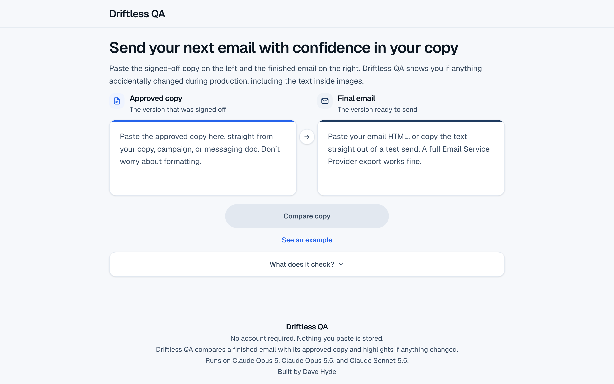
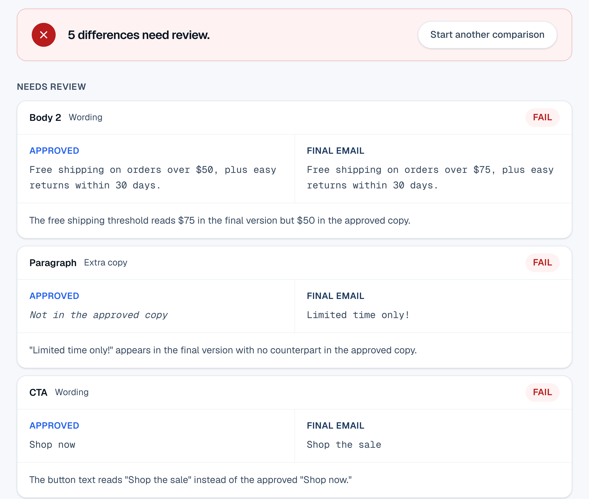

# Driftless QA

**Live app: [driftlessqa.com](https://driftlessqa.com)**

Driftless QA checks a finished marketing email against the copy that was approved for it, and reports anything that changed along the way. You paste the approved copy on one side and the final email on the other, and it lists each difference with a short explanation.

It compares. It does not proofread. If the approved copy has a typo and the final email repeats it exactly, that passes.

This repository is a showcase of how the app is built and why. The application code is in a private repository.



The left box takes the approved copy, pasted from a copy doc. The right box takes the email's HTML, or the text copied out of a test send.



Each card shows the approved text next to what the email actually says, with a one-line explanation. Only failures count toward the verdict at the top.

## Why it exists

Email QA tools like Litmus and Email on Acid check rendering, links, accessibility and deliverability. None of them check whether the final email says what the approved copy said.

Copy changes during production. It gets moved from a copy doc into an email builder, edited late and reviewed by several people, and small changes still get through: a changed price, last month's offer, a button that lost its capitalization, a paragraph that was dropped. Once an email is sent, it can't be unsent. Driftless QA does that one check.

## How it works

Most of the comparison is ordinary code. It strips the HTML down to the visible text, sets aside things that aren't copy (such as the unsubscribe footer), and smooths over differences that don't matter, like curly versus straight quotes. Then it works out which part of the email each piece of approved copy became, compares the two word by word, and decides what kind of difference each one is and how serious it is.

AI is used in three places, each for a job ordinary code does badly: matching a heavily reworded paragraph to the approved version it came from, reading text that is part of an image, and writing the one-line explanation on each finding. The diagram shows the full pipeline for technical readers.

```
  PASTED INPUT
  approved copy doc                    final email (ESP HTML or rendered text)
        │                                          │
        ▼                                          ▼
  ┌───────────┐                            ┌───────────┐
  │ 1 EXTRACT │  strip markup, keep        │ 1 EXTRACT │
  │ 2 PARSE   │  visible text + light      │ 2 PARSE   │
  │           │  structure                 │           │
  └─────┬─────┘                            └─────┬─────┘
        │  labeled blocks                        │  ordered text runs
        │  (Headline:, Body:, CTA:…)             │
        ▼                                        ▼
  ┌──────────────────────────────────────────────────────┐
  │ 3 REMOVE    subject / preheader, boilerplate         │
  │ 4 NORMALIZE smart quotes, entities, whitespace       │
  │ 5 DEDUPE    responsive duplicates (mobile variants)  │
  └───────────────────────┬──────────────────────────────┘
                          ▼
  ┌──────────────────────────────────────────────────────┐
  │ 6 ALIGN   which run is this block?                   │
  │                                                      │
  │   tier 1  string similarity, deterministic           │
  │           ├─ resolved ──────────────┐                │
  │           └─ leftovers              │                │
  │                  ▼                  │                │
  │   tier 2  model proposes pairings   │   ← AI         │
  │           ├─ paired ────────────────┤                │
  │           └─ still unresolved ──────┼─→ WARNING      │
  └───────────────────────┬─────────────┘   (never a     │
                          ▼                  guess)      │
  ┌──────────────────────────────────────────────────────┐
  │ 7 DIFF      word-level, on aligned pairs only        │
  │ 8 CLASSIFY  issue type + severity  ← deterministic   │
  │ 9 EXPLAIN   one sentence per finding   ← AI          │
  └───────────────────────┬──────────────────────────────┘
                          ▼
                    PASS / FAIL / WARNING
```

Images are handled alongside the main comparison. The server fetches each image in the email and reads all of them in one AI call, so copy inside a hero image gets checked too.

## Two rules the design follows

**The AI suggests matches, and code makes every decision.** The AI may suggest which part of the email a piece of approved copy turned into. It never decides whether anything passes or fails. Every verdict comes from fixed rules in code. The matching prompt only asks which piece goes with which, and never asks what changed. That keeps the app away from the main problem with pasting two documents into a chatbot and asking for the differences, which is that a model will confidently describe differences that aren't there.

**When the app isn't sure, it says so.** If the app can't tell with confidence which part of the email a block of approved copy became, it doesn't compare the block against a guess. It shows a warning instead. Warnings never turn the result red, and only failures do. A false warning costs the reader a few seconds, but a red result on a correct email would make every later green result harder to trust.

## Where AI is used

| Step | How | Model | Why |
|---|---|---|---|
| Extracting and cleaning the text | Code | None | Mechanical and exactly specifiable. A model would add cost, delay and inconsistency for no benefit. |
| Matching copy, first pass | Code (string similarity) | None | Handles clean, labeled copy on its own, so that kind of comparison never needs the AI step below it. |
| Matching copy that was heavily rewritten | AI, structured output | Claude Opus 5.5 | Only sees what the first pass couldn't place. A reworded paragraph defeats string matching but is obvious to a person. |
| Reading text inside images | AI, vision | Claude Opus 5 | Text inside artwork is invisible to every other check. Image findings are capped at warnings, because reading an image is never certain enough to fail an email. |
| Pass and fail | Code, always | None | See the first rule above. |
| Explaining each finding | AI, one call per comparison | Claude Sonnet 5.5 | The one step where the writing is the point. Falls back to plain built-in sentences if the call fails. |

Every AI step is allowed to fail without breaking the app. When a call fails, the job tries a backup model first. If that fails too, the comparison still finishes and returns what the ordinary code produced.

## Choosing and testing the models

The three AI jobs use different models because each job was tested on its own. The app's end-to-end test set can't tell models apart on these jobs, so a separate benchmark measures them directly: 31 generated images with known text (including typos baked into the artwork and hard cases like script fonts, faint text and letter-spaced capitals), 16 matching cases with 64 decisions that each have one right answer, and 19 real findings whose explanations are read side by side. Every model runs every job three times.

A few results shaped the current setup. In September, Claude Haiku 4.5 read the typo "Limted" in an image as "Limited", at 99% confidence, on every run. It scored well overall, but it silently fixed the exact kind of mistake the image check exists to catch. The newest model wasn't the best choice for every job either. Claude Opus 5.5 read every test image correctly, but it rated its confidence on the hardest ones at exactly the app's 80% cutoff, where a small drop would make the app throw a correct reading away. So image reading stayed on Claude Opus 5.

The benchmark also tests each model at low, medium and high thinking levels, and more thinking wasn't always better. For image reading on Opus 5, high fixed a misread that low made twice in three runs, where it read letter-spaced capitals as "L I M I T E D". On Opus 5.5 the same change lowered its confidence until it started discarding correct readings. Each job's level is now set from these results: high for image reading, and medium for matching and explanations. Explanations moved to Claude Sonnet 5.5, which wrote them as accurately as Opus, about a second faster per call, at 40% of the price.

Anthropic's status page showed problems affecting these models every week or two during September, usually for one to three hours, and most of them hit a single model. So each job has a backup on a different model:

| Job | Main model | Backup |
|---|---|---|
| Matching rewritten copy | Claude Opus 5.5 | Claude Opus 5 |
| Reading text inside images | Claude Opus 5 | Claude Sonnet 5.5 |
| Explaining findings | Claude Sonnet 5.5 | Claude Opus 5 |

Each AI call gives up after 45 seconds and moves to the backup, instead of waiting the default ten minutes. The limit comes from timing deliberately oversized jobs, where the slowest call took 28 seconds. The backups were tested against the real API by pointing each job at a model name that doesn't exist, and each backup took over in about three seconds. The site's footer lists the models in use, and it is generated from the same settings the app runs on, so it updates whenever a model changes.

## Other engineering decisions

**Thresholds come from tests.** The score that decides whether two pieces of text are the same block started as a guess of 0.90. Testing it against the full set of example emails showed every pair that should match scoring 0.91 or higher and every pair that shouldn't scoring 0.75 or lower. The threshold is set at 0.85, in the middle of that gap, instead of at 0.90, right at the edge where a slightly reworded paragraph would stop matching.

**Fetching images is treated as a security risk.** The app accepts HTML from anyone, pulls image addresses out of it, and fetches them from its own server. That is a classic way to trick a server into reaching places it shouldn't, known as server-side request forgery. Every fetch is checked: the address has to be public (checked after looking up where the name actually points), redirects aren't followed, and only real images under 5 MB are accepted, within a time limit. A rejected fetch fails silently, because a detailed error message would help someone probe the server.

**The limits are described as they are.** Rate limiting allows 50 comparisons per IP address per hour. It runs in memory, so each server instance keeps its own count, and anyone determined could get around it. It is there to stop accidental loops, and nothing more. A shared database would make it airtight, and that was judged not worth it for an app of this size.

**Speed was measured with a profiler.** Matching takes about 96% of the time on a large comparison, and its cost depends on how much text is left after the HTML is stripped. Real email exports are mostly markup. One measured template had 2.5 KB of copy inside 108 KB of HTML, so even 400 KB of HTML compares in about 24 milliseconds.

## Testing

| | |
|---|---|
| Unit tests | 305, in 15 test files |
| End-to-end test set | 28 pairs of approved copy and final email: 14 that should pass and 14 with a planted mistake |
| Score with AI | All 14 mistakes caught at the right severity, no false alarms, and 28 of 28 verdicts correct |
| Score without AI | 13 of 14 mistakes caught, with 2 false alarms |
| Model benchmark | 31 images, 64 matching decisions and 19 explanations, three runs per model |

The end-to-end set checks severity as well as detection, so catching a real problem at the wrong level counts against the score. No threshold in the code changes without running it. The scores above were measured on October 6, 2026.

## Tech stack

The app is built with Next.js 16, React 19, TypeScript in strict mode and Tailwind CSS 4, and it is hosted on Vercel with automatic deploys from the main branch. It calls Claude through Anthropic's official TypeScript SDK, with Zod schemas so each model returns typed data instead of prose that has to be parsed. The comparison engine is plain TypeScript made of pure functions, with no dependencies beyond an HTML parser, and it is tested with Node's built-in test runner.

All AI calls happen on the server, and the API key never reaches the browser, the code repository or the logs. Nothing a user pastes is stored. An optional password gate, using a signed session cookie, can be switched on with one setting and no code change.

## How this was built

Driftless QA was built with [Claude Code](https://claude.com/claude-code), Anthropic's AI coding tool. Dave Hyde directed the project and made the final decisions, and Claude wrote the code.

This README was written by Claude Opus 5.5 in Claude Code, from the project's own notes and a fresh run of its tests. Dave did not write or edit it.

Built by **Dave Hyde** · [driftlessqa.com](https://driftlessqa.com)
